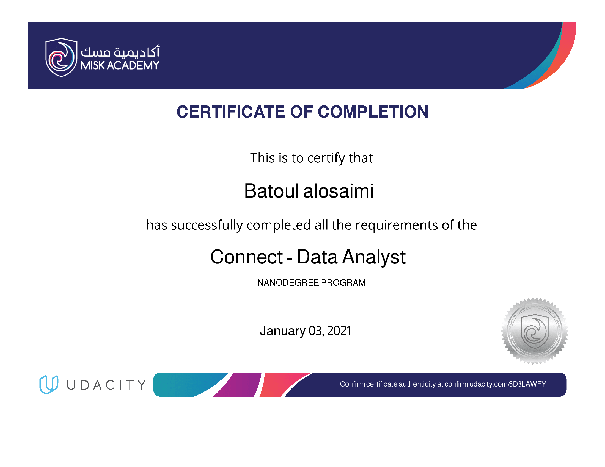

# Udacity Data Analyst Nanodegree 

### Collection of Projects of Udacity Data analysis Nanodegree.

#### DAND Certificate 

Project Lists:

- Project 1:[ Exploring Weather Trends](https://github.com/batoull22/Data-Analyst-Nanodegree-Program-/tree/main/Exploring%20Weather%20Trends)

Analyzes local and global temperature data and compares the temperature trends where you live to overall global temperature trends.

- Project 2: [ TMDb Movie Data Analysis](https://github.com/batoull22/Data-Analyst-Nanodegree-Program-/tree/main/TMDb%20Movie%20Data%20Analysis)

Investigate a dataset analyzes a dataset and then communicate the findings.

- Project 3: [ Analyze AB Test Results](https://github.com/batoull22/Data-Analyst-Nanodegree-Program-/tree/main/Analyze%20AB%20Test%20Results)

Understand the results of an A/B test run by an e-commerce website.

- Project 4: [ Data wrangles](https://github.com/batoull22/Data-Analyst-Nanodegree-Program-/tree/main/data%20wrangle)

Wrangle and Analyze Data wrangles and analyzes the tweet data of WeRateDogs that rates people's dogs with a humorous comment about the dog.

- Project 5: [ Analyzing Ford GoBike System](https://github.com/batoull22/Data-Analyst-Nanodegree-Program-/tree/main/Analyzing%20Ford%20GoBike%20System)

Communicate Data Findings deals with data exploration of the flight's cancellation and delay dataset mainly using data visualization and presenting the findings using explanatory visualizations.
